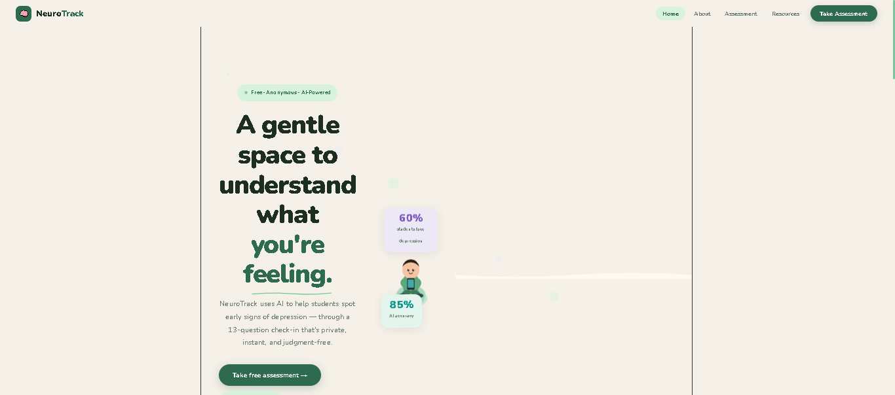
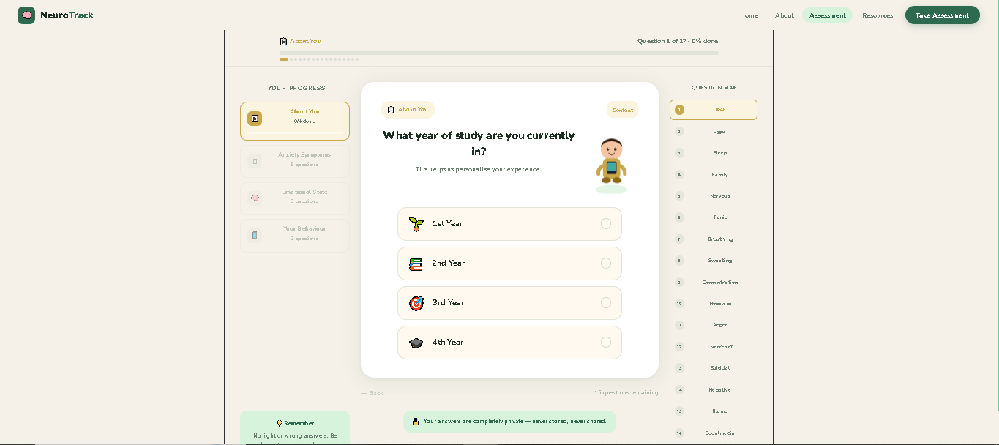
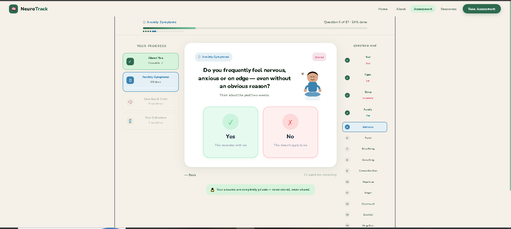
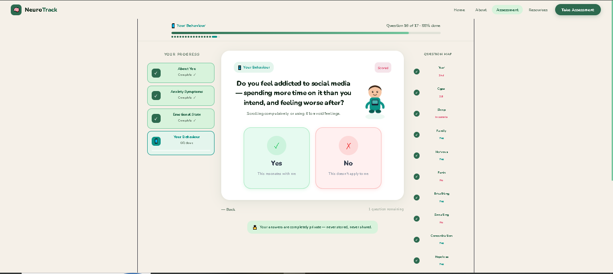
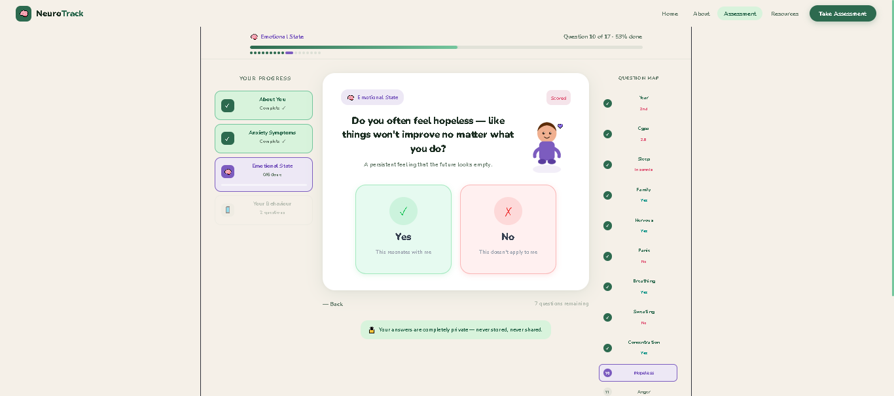
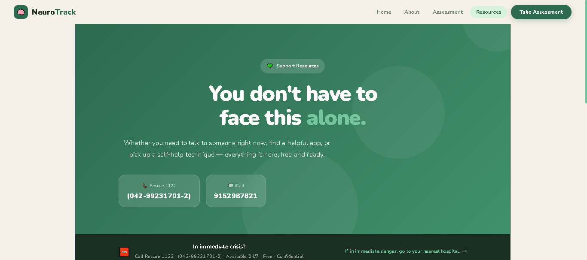
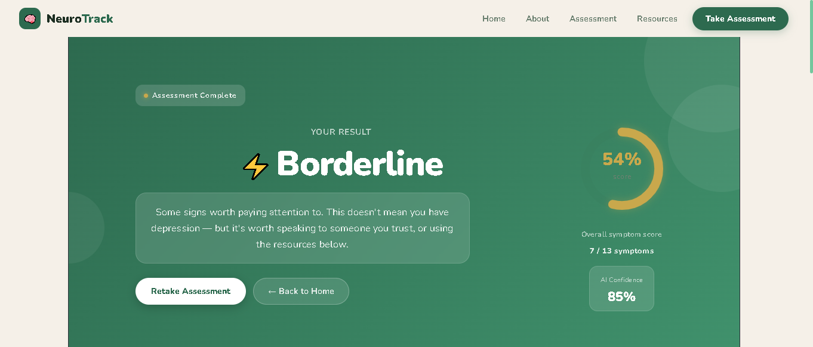

# NeuroTrack AI

NeuroTrack AI is an AI-powered student mental health screening web application designed to support early awareness of depression-related risk patterns among university students.

The system provides a private, anonymous, and user-friendly self-assessment experience based on a structured questionnaire. It helps users understand possible mental health risk indicators and provides supportive resources.

> **Disclaimer:** NeuroTrack is an academic project created for educational and research purposes only. It is not a medical diagnosis tool and should not replace consultation with qualified mental health professionals.

---

## Overview

Mental health challenges among university students are becoming increasingly common due to academic pressure, social stress, financial concerns, lifestyle changes, and future uncertainty.

NeuroTrack aims to provide an accessible web-based screening platform that allows students to complete a self-assessment and receive a risk-level result with guidance and support resources.

The project focuses on combining AI concepts, web development, and mental health awareness in a responsible and student-centered way.

---

## Problem Statement

Many university students experience symptoms of stress, anxiety, low mood, and depression but may hesitate to seek help due to stigma, lack of awareness, or limited access to support resources.

NeuroTrack provides a simple and private screening interface that can help students reflect on their mental health condition and access supportive guidance.

---

## Objectives

- Provide a private and user-friendly student mental health screening platform.
- Use a structured questionnaire to identify depression-related risk patterns.
- Display risk-level results in a clear and understandable way.
- Offer supportive mental health resources.
- Promote early awareness without replacing professional medical evaluation.

---

## Key Features

- Modern React-based web interface
- Student-focused mental health self-assessment
- 17-question psychometric-style assessment flow
- Risk-level result generation
- Supportive resource page
- Clean landing page, about page, assessment page, and result section
- Responsive UI built with React and Vite
- Privacy-focused and academic-purpose design
- Simple navigation between Home, About, Assessment, and Resources pages

---

## Tech Stack

- React.js
- Vite
- JavaScript
- HTML
- CSS
- Machine Learning concept integration
- Git & GitHub

---

## Project Pages

- **Home Page:** Introduces NeuroTrack and explains the project purpose.
- **About Page:** Explains the motivation, background, and project goals.
- **Assessment Page:** Allows users to answer structured mental health screening questions.
- **Result Page:** Displays risk-level result and supportive guidance.
- **Resources Page:** Provides mental health support information and helpful resources.

---
## Project Structure

```text
neurotrack/
  public/
  src/
  screenshots/
  index.html
  package.json
  package-lock.json
  vite.config.js
  README.md
  .gitignore
```

---

## Screenshots

### Landing Page


### Assessment - About You


### Assessment - Anxiety


### Assessment - Behavior


### Assessment - Emotional


### Resources Page


### Result Page
